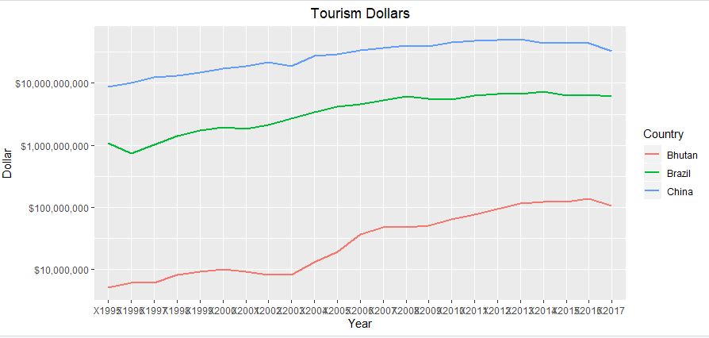

# TouristCurrency

Captured data from a tourist website into an .xlsx file. Created models in R-studio using functions that allows the user to input
the country name and then plots the data for the user.
Designated X-axis to contain the years and the Y-axis to contain the money spent. Created this project and performed the
required data analytics in R-studio.

